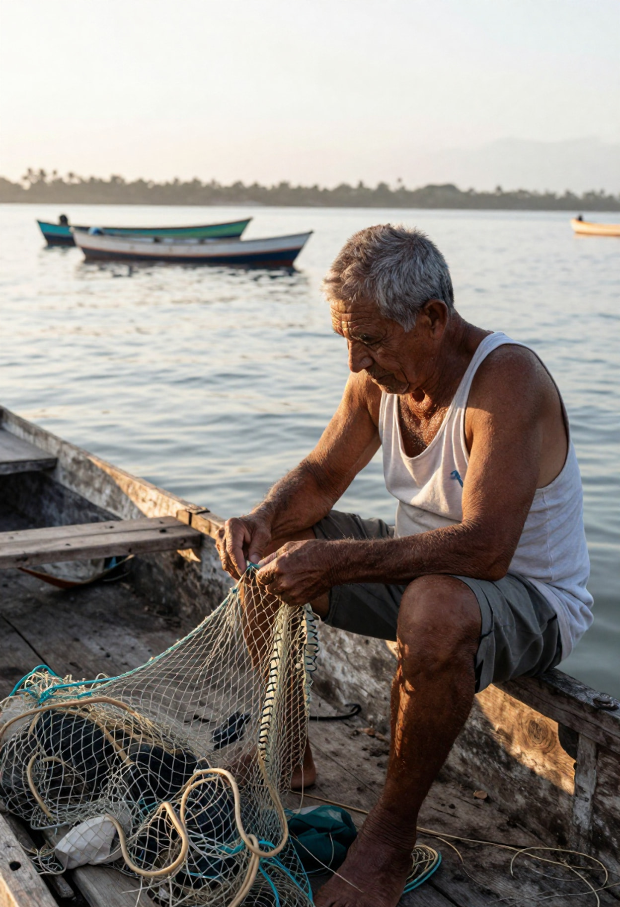
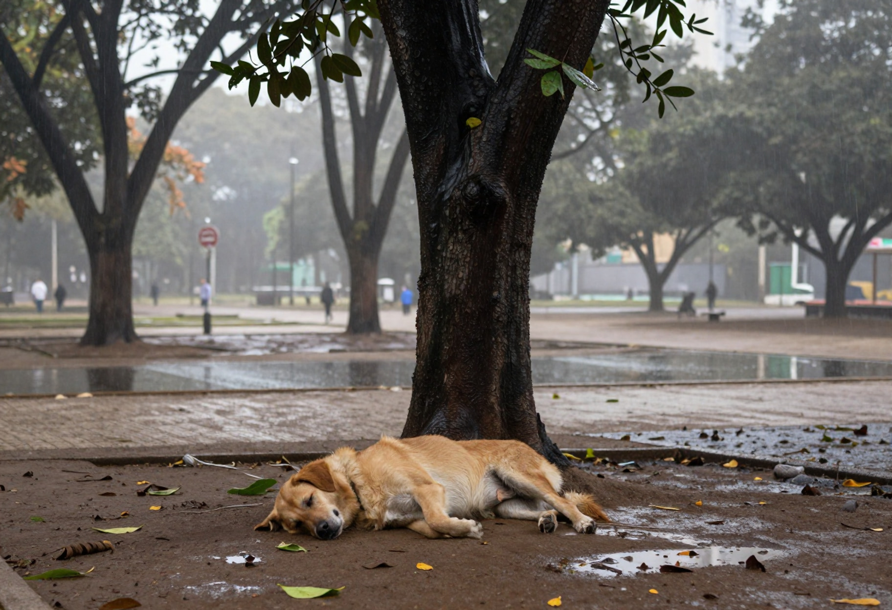
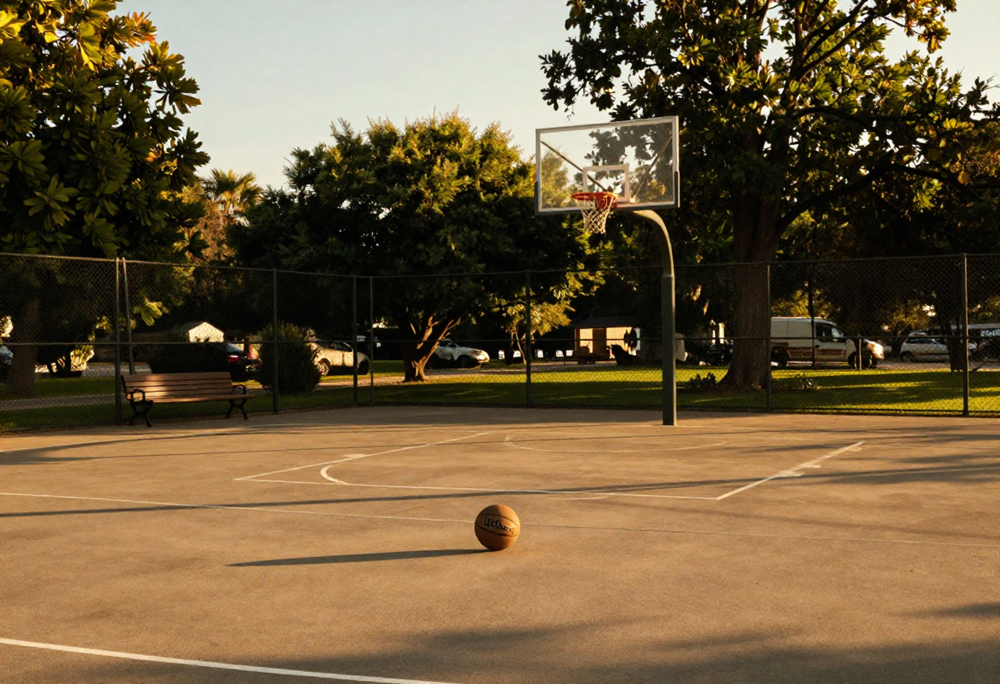

# Examples

These are full-resolution outputs from the local Draw Things pipeline, not
mockups or third-party stock images.

| Example | File | Delivery size |
| --- | --- | ---: |
| Documentary fisherman | [`documental-fisherman.jpg`](assets/examples/documental-fisherman.jpg) | 1248 × 1824 |
| Dog in a rainy park | [`dog-sleeping-in-rainy-park.jpg`](assets/examples/dog-sleeping-in-rainy-park.jpg) | 1824 × 1248 |
| Golden basketball court | [`golden-basketball-court.jpg`](assets/examples/golden-basketball-court.jpg) | 1824 × 1248 |

## Documentary fisherman

[](assets/examples/documental-fisherman.jpg)

Example brief for the same kind of scene:

```bash
local-photo generate \
  "fotografia documental de um pescador idoso consertando uma rede dentro de um barco de madeira, lago calmo ao fundo, luz natural do começo da manhã, pele e mãos com textura real, momento observado e não posado" \
  --preset natural --size post-portrait
```

## Dog sleeping in a rainy park

[](assets/examples/dog-sleeping-in-rainy-park.jpg)

Example brief for the same kind of scene:

```bash
local-photo generate \
  "cachorro caramelo dormindo sob uma árvore em um parque durante a chuva, poças no chão, poucas pessoas desfocadas ao fundo, fotografia documental comum" \
  --preset natural --size landscape
```

## Golden basketball court

[](assets/examples/golden-basketball-court.jpg)

Example brief for the same kind of scene:

```bash
local-photo generate \
  "quadra de basquete vazia no fim da tarde, uma bola parada no chão, luz dourada atravessando as árvores, fotografia ambiental realista, composição ampla" \
  --preset natural --size landscape
```

## Reproducibility note

Every new generation writes a JSON sidecar containing its final brief, seed,
model settings and output paths. Keep that sidecar if exact reproduction on
the same Draw Things build and hardware matters:

```bash
local-photo reproduce path/to/image.json
```

The original sidecars for the three historical examples on this page were not
retained. The commands above are therefore representative briefs, not invented
claims about the exact prompts or seeds that produced the committed files.

## Rights and external components

The example files are original outputs generated with this project and are
included under the repository's [MIT License](../LICENSE). The repository does
not redistribute model weights. The generator and every optional component,
their sources and their upstream licences are documented in
[`MODELS.md`](MODELS.md) and [`config/models.json`](../config/models.json).
